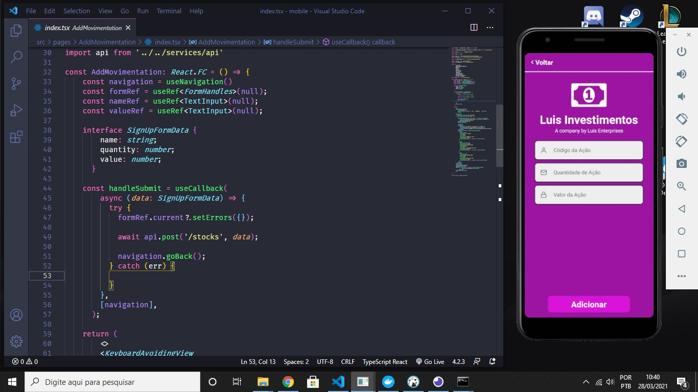

<h1 align="center">
    Luis Investimentos
</h1>

<h4 align="center">
  📊Controlador de Ações
</h4>

 

Tela inicial do App

  

 

Tela de adicionar ações do App

  

 

Dados armazenados no Banco de dados

  

## :rocket: Tecnologias

Esse projeto foi desenvolvido com as seguintes tecnologias:

- [Node.js](https://nodejs.org/en/)
- [React](https://reactjs.org)
- [React Native](https://facebook.github.io/react-native/)
- [Postgres](https://www.postgresql.org/)

## 💻 Projeto

App para controle de ações da minha carteira

## 🤔 Como contribuir

- Faça um fork desse repositório;
- Cria uma branch com a sua feature: `git checkout -b minha-feature`;
- Faça commit das suas alterações: `git commit -m 'feat: Minha nova feature'`;
- Faça push para a sua branch: `git push origin minha-feature`.

Depois que o merge da sua pull request for feito, você pode deletar a sua branch.
